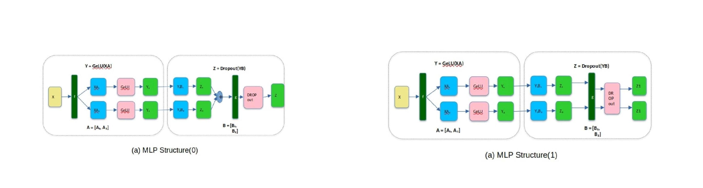
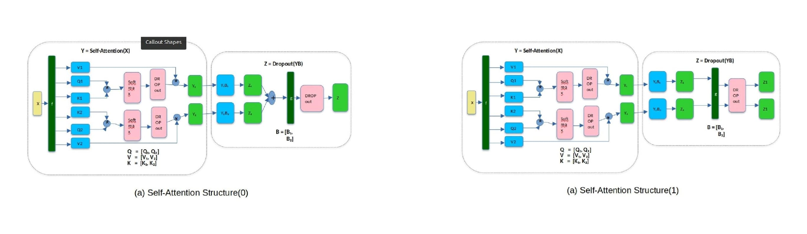
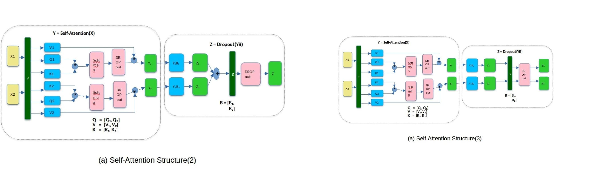

# Abstract

In this work, we introduce Additive AI, a framework for training deep learning models through structured architectural variation. We will define a model family where each + operation will control whether a submodule (e.g., residual block) is activated or skipped, creating 2ⁿ architectures from *n* binary decisions.

# Track 1 Structure as Expert(MoSE)
Experiment 1: Parallel Architecture Search 
We will deploy a multi-GPU system where each GPU will train a unique architecture on the same dataset. Performance metrics will be compared to identify the top-K structures.

Experiment 2: Gradient-Cooperative Training
The top-K models will be co-trained using distributed gradient averaging (ring AllReduce) to merge their learning signals while preserving architectural diversity.

Experiment 3: Stochastic Structural Regularization
During training, we will randomly gate + operations (like "architectural dropout") to prevent overfitting and encourage robust feature reuse.

Experiment 4: In contrast to standard Mixture of Experts (MoE) models—where all experts share the same structure and only differ by routing—Additive AI defines an exponential family of expert models ( ( 2^n ) variants) that differ structurally through binary decisions applied to + (addition) operations. Each + operation in the architecture acts as a gate, controlling whether a submodule (e.g., subactivation, residual block) is included or skipped, resulting in a diverse set of model structures with shared weights.


# Code
```py
from transformers import  AutoConfig
from Additive_Ai.transformerlayers import  DeepseekV2MLPSplit
from Additive_Ai.DeepSeek_V2.modeling_deepseek import DeepseekV2DecoderLayer, DeepseekV2Config 
import itertools

config = AutoConfig.from_pretrained('DeepSeek_V2',trust_remote_code=True)
structs = list(itertools.product([ False, True], repeat=6))
moe_layer_1 = DeepseekV2DecoderLayer(config, 1)

for i in range(len(structs)):
  moe_layer_1.mlp.experts[i] = DeepseekV2MLPSplit(moe_layer_1.mlp.experts[0],num_splits=7 struct=structs[i])
```
# Test on Vgg19
https://www.kaggle.com/code/giriprasad512/vgg19-moe-structure-as-expect

# MLP
<table>
  
  <tr>
    <td valign="top"></td>
    
    
  </tr>
  <td valign="top"></td>
  <tr>
    
  </tr>
 </table>

# Attention
<table>
  
  <tr>
    <td valign="top"></td>
    
    
  </tr>
  <td valign="top"></td>
  <tr>
    
  </tr>
 </table>


